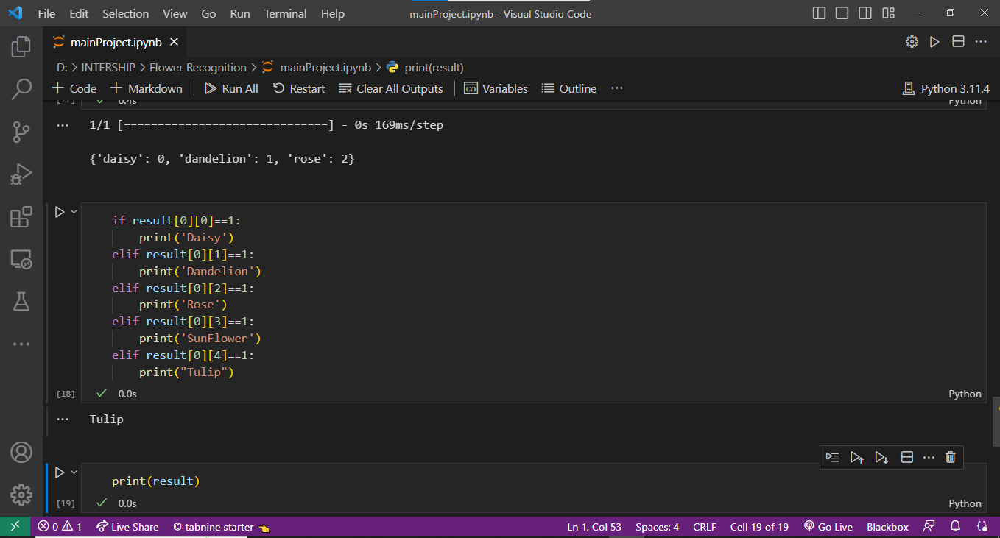

# Flower-Recognition Project

This plant leaf disease detection project was developed using Python, Flask, TensorFlow, and NumPy. The model was trained over 3000+ datasets of plant leaf images, and it can now accurately identify 10+ different types of plant diseases. The project is deployed as a web application, where users can upload images of plant leaves, and the model will predict the type of disease.

## Technologies Used

- TensorFlow: An open-source machine learning framework used for training and building the deep learning model.
- NumPy: A powerful library for numerical computing in Python, used for efficient array operations and data manipulation.
- Flask: A micro web framework used for deploying the plant leaf disease detection model as a web application.
- Python: The primary programming language used for building the model and the web application.

## How to Use

1. Clone the repository to your local machine.
2. Install the necessary dependencies using `pip install -r requirements.txt`.
3. Run the Flask web application using `python app.py`.
4. Access the web application in your browser at `http://localhost:5000`.
5. Upload images of plant leaves to get predictions for plant diseases.

## Dataset

The model was trained using a dataset of 3000+ images of plant leaves, annotated with different types of plant diseases. The dataset was used to train the deep learning model to accurately classify and detect plant leaf diseases.

## Contributions

Contributions to the Plant Leaf Disease Detection Project are welcome! If you find any issues or want to add new features, feel free to submit bug reports, feature requests, or pull requests to help improve the project.

## Contact

For any inquiries or questions, please contact [saqlainrashed2001@gmail.com](mailto:your-email-address). We would love to hear your feedback and suggestions!
